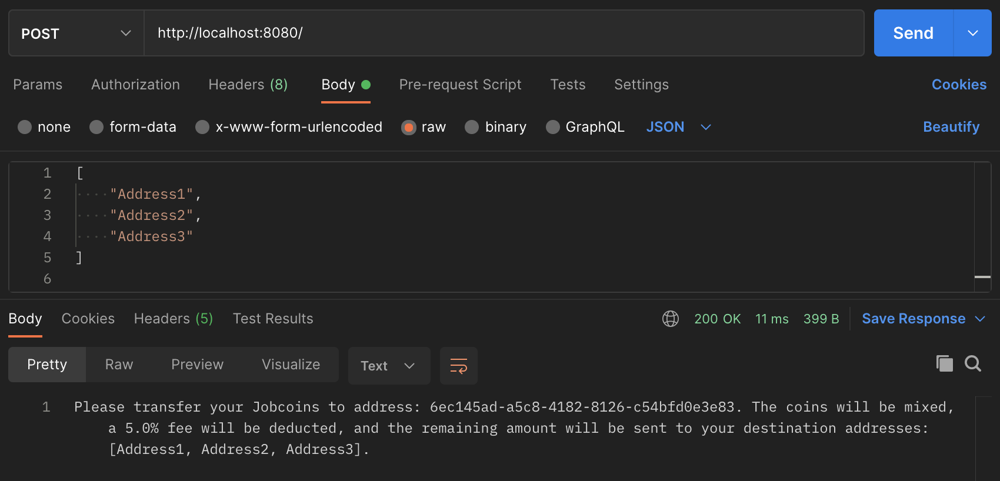

# Coin Mixer 

This is a coin mixer implementation. Any Coin (a made-up currency) address owner can send a set of addresses to the mixer and the mixer will provide a deposit address to which they send their coins. The mixer then deposits these coins minus a fee to the set of withdrawal addresses provided by the user.

## Table of Contents

- [Getting Started](#getting-started)
- [Architecture](#architecture)
  - [Key Features](#key-features)
  - [Requirements](#requirements)
  - [Assumptions](#assumptions)
  - [Technologies and Platforms](#technologies-and-platforms)
  - [User Interface](#user-interface)
  - [Application Flow Through Kafka](#application-flow-through-kafka)
  - [Database](#database)
  - [Next Steps and Future Enhancements](#next-steps-and-future-enhancements)

## Getting Started

To get started, make sure that Docker and Docker Compose are installed on your system and run `docker-compose up -d` to start Kafka. Then run `mvn install` and run Application.java to start the application.

## Architecture

### Key Features

* Provides a better level of privacy and anonymity by mixing the coins and sending them to withdrawal addresses in random small amounts, in random order and with random time delay
* Handles high volumes of transactions by utilizing Kafka
* Does not save any outgoing transactions into a database 

### Requirements

The required user flow for the Coin Mixer is as follows: 
1. User provides a list of new, unused addresses to the mixer.
2. The mixer returns a new deposit address to the user.
3. The user transfers Coins to the given deposit address via Coin Viewer.
4. The mixer detects the transfer to the deposit address by polling the Coin network.
5. The mixer transfers the Coins from the deposit address to the house address.
6. The mixer deducts the mixing fee.
7. The mixer returns the remaining Coins in small random increments over randomized periods of time to the withdrawal addresses the user provided.

### Assumptions

* User should be providing multiple withdrawal addresses (>1) to fully randomize the transactions.
* To randomize the transactions and their time delays, Java's pseudo random number generator is used.
* The Coin network is currently queried every 60 seconds (CronService.java) to search for new transactions to mixer's addresses. The interval can be updated in `application-local.properties` (cron-watch-interval).
* For sending the Coin to the withdrawal addresses, there is a randomized delay. The limits for that delay are set in `application-local.properties` (min-delay-seconds, max-delay-seconds). As of now, the delay is set to be between 5 and 30 seconds. This time limit can be increased to provide more anonymity.
* The mixer charges the user a 5% fee. The mixer's transaction fees remain in its house account. This fee can be adjusted in `application-local.properties` (mixer-fee).

### Technologies and Platforms 

This application is using [Java](https://www.java.com/en/), [Spring.io](https://spring.io/) and [Kafka](https://Kafka.apache.org/),
and is built on top of Docker and Docker Compose to ease the setup process.

### User Interface

Given the simplicity of this coin mixer prototype, there is no built-in UI. In order to use the mixer, a user has to make a POST call to this service with a list of addresses as the payload. In return, the user will receive a new address belonging to the mixer. The user can then transfer the coins via the Coin network to the deposit address returned by the POST call.

For example, Postman can be used to make the call: 

### Application Flow Through Kafka

By design, any coin mixer has to handle many more outgoing transactions than incoming. Kafka was chosen to handle the outgoing transactions as it is highly scalable and capable of handling high-volume data. The Kafka server runs on `localhost:9092`.

When the application starts, the scheduler starts pinging the Coin network every 60 seconds looking for new Coin transactions to the mixer's addresses that need execution.
Once a record is found, it will be sent to the mixer's house address and a mixing fee will be deducted. Then the remaining amount will be split into a series of randomized transactions to the user's withdrawal addresses and these transactions are sent to the Kafka queue.

The Kafka consumer will then pick up any transactions found in the queue and will send them via REST calls to the Coin network with randomized time delays.

### Database

For simplicity, the application is using an in-memory Spring Boot H2 database. By design, this DB is ephemeral and its data will be lost when the application is restarted. The only data we store is the address mappings between mixer's deposit addresses and the user withdrawal addresses, and the timestamp of the last transaction to the mixer's deposit addresses. That allows us for filtering out the transactions that we already mixed in the past, and focusing only on new transactions.

### Next Steps and Future Enhancements

This is a prototype of a coin mixer. In order to be able to productionalize it, these points will need to be addressed: 

* **Scalability**. As the Coin network and the mixer itself scales, the mixer needs to find a better way to get the transactions that are sent to the mixer's addresses. Right now, the application makes address info API calls for each of the addresses the mixer owns to get all the new transactions. 
It is not feasible to make an API call to the Coin network's transaction API to get all transactions and filter for all transactions to mixer's addresses because this API returns all transactions since the beginning of Coin existence and these will grow significantly.
* **Exception handling**. The application needs to be revised for custom exception handling, e.g. related to Kafka or API exceptions.
* **Data security, encryption and authorization**. A real database will have to be used instead of the in-memory one. With that comes security of the data, encryption and authorization.
* **Comparison with existing solutions**. A thorough analysis of existing coin mixers will have to made in order to establish this mixer's positioning and improve key features.
* **Contracts and SLAs**. SLAs would need to be established for data latency, availability and anticipated request rate.
* **Resiliency and availability**. When it comes to the deployment of this application, attention will need to be placed around the resiliency and high availability of this coin mixer (e.g. if it's a deployment to Kubernetes, attention needs to be given to the number of pods, distribution of pods on nodes). Also, a strategy will have to be in place to handle any individual component failure or a disaster, e.g. complete datacenter outage or common infrastructure failure.
* **Component health monitoring and alerting**. Attention needs to be given to the component health monitoring and alerting. We will want to know that something is happening with the Coin Mixer from the automated notifications, not the users themselves. We will also need to monitor the health of the Coin network.
* **Infrastructure and resource consumption**. The infrastructure and the critical resources (CPU consumption, queue sizes, network bandwidth, etc.) will have to be monitored and a plan needs to be in place to act in case of resource exhaustion or threat of exhaustion.
* **Performance and capacity planning**. We will need to consider how the application will scale as demand increases (additional resources, parallelization, caching, load testing etc.).
* **SDLC and testing**. We will need to consider how fast a change can be pushed in case of emergency and what approvals are required. The application needs to be thoroughly tested (as of now, the tests are minimal).
